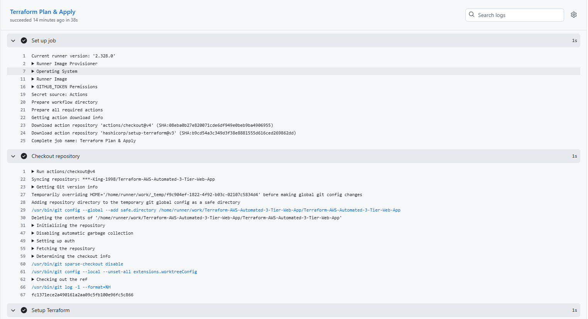
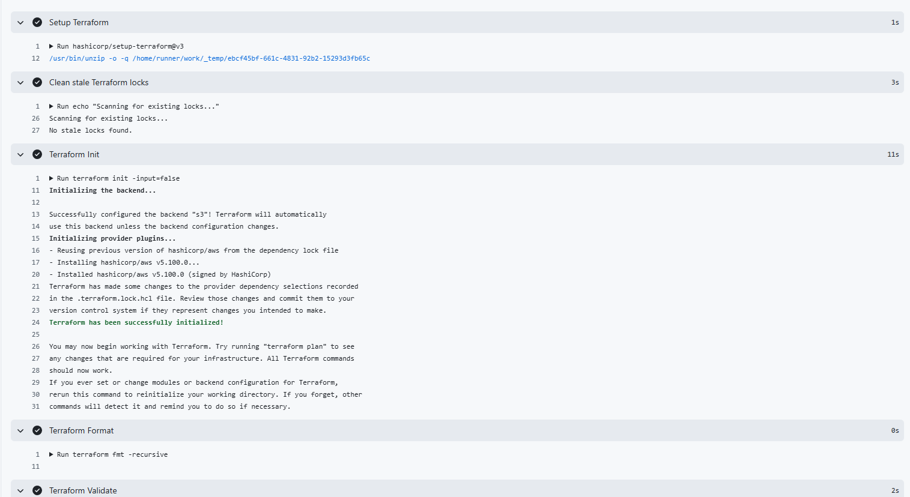
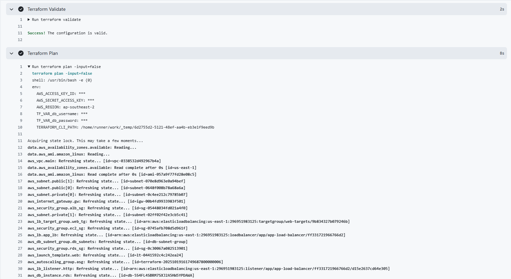
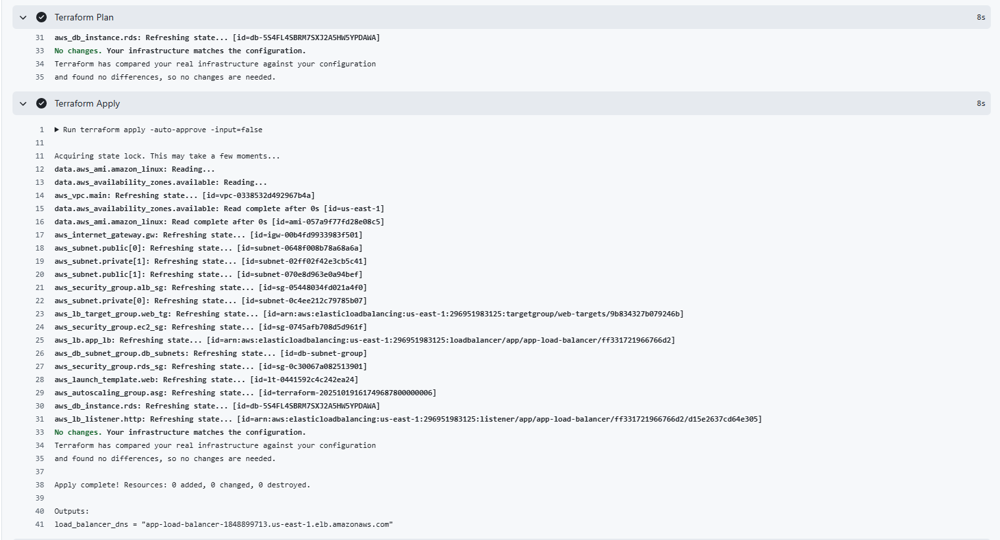
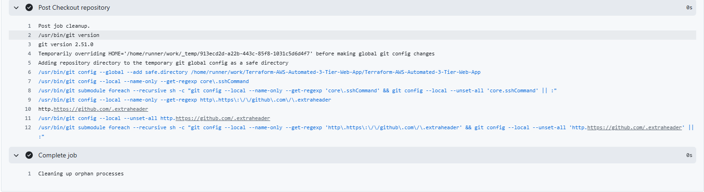

# Terraform CI/CD Pipeline

This project demonstrates a fully automated CI/CD workflow for Terraform infrastructure deployments on AWS. It integrates GitHub Actions to automatically run `terraform fmt`, `validate`, `plan`, and `apply` whenever changes are pushed to the repository. The pipeline handles backend state management using an S3 bucket and DynamoDB for state locking, including automatic cleanup of stale locks. Sensitive variables such as database credentials are securely passed via GitHub Secrets.

---

## 🚀 Features

- **Automated Terraform workflow:** Runs `fmt`, `validate`, `plan`, and `apply` automatically on pushes and pull requests.  
- **Remote state management:** Uses an S3 bucket as the Terraform backend.  
- **State locking:** Uses a DynamoDB table to prevent simultaneous modifications.  
- **Automatic lock cleanup:** Detects and deletes stale or corrupted locks before Terraform runs.  
- **Secure secrets handling:** Pass sensitive variables like DB credentials via GitHub Secrets.  

---

## 🛠 Tech Stack

- **Terraform** v1.8.x  
- **AWS S3** (remote state backend)  
- **AWS DynamoDB** (state lock management)  
- **GitHub Actions** (CI/CD automation)  
- **GitHub Secrets** (secure environment variables)  

---

## 📂 Project Structure


├─ **.github/workflows/**  
 └─ **terraform-deploy.yml** # CI/CD workflow  
├─ **main.tf** # Example backend and provider setup  
├─ **variables.tf** # Input variables for Terraform  
├─ **README.md** # Project documentation  

---

## ⚙️ Setup Instructions

**1. Create an S3 bucket for Terraform state:**  

```
aws s3api create-bucket --bucket <your-terraform-state-bucket> --region <region> --create-bucket-configuration LocationConstraint=<region>
```

**2. Create a DynamoDB table for state locks:**

```
aws dynamodb create-table \
  --table-name terraform-locks \
  --attribute-definitions AttributeName=LockID,AttributeType=S \
  --key-schema AttributeName=LockID,KeyType=HASH \
  --billing-mode PAY_PER_REQUEST \
  --region <region>
```


**3. Add GitHub Secrets:**
 
**AWS_ACCESS_KEY_ID**	AWS access key for Terraform  
**AWS_SECRET_ACCESS_KEY**	AWS secret key for Terraform  
**DB_USERNAME**	Database username (example variable)  
**DB_PASSWORD**	Database password (example variable)  

**4. Push your code to GitHub and the workflow will automatically run.**


## **📸 Run Screenshots**











